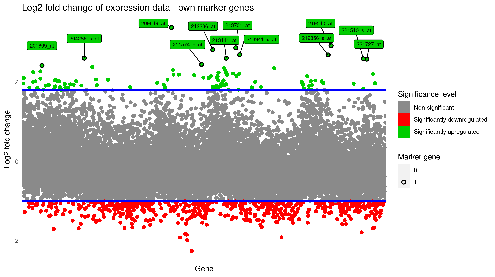
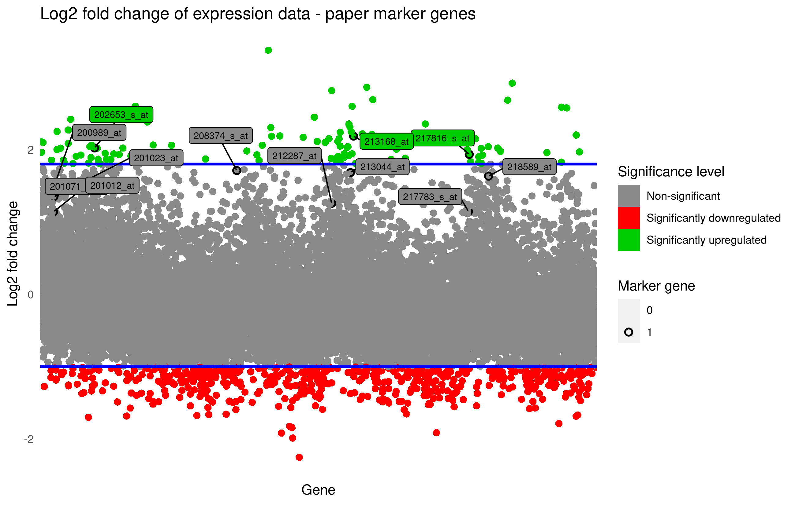
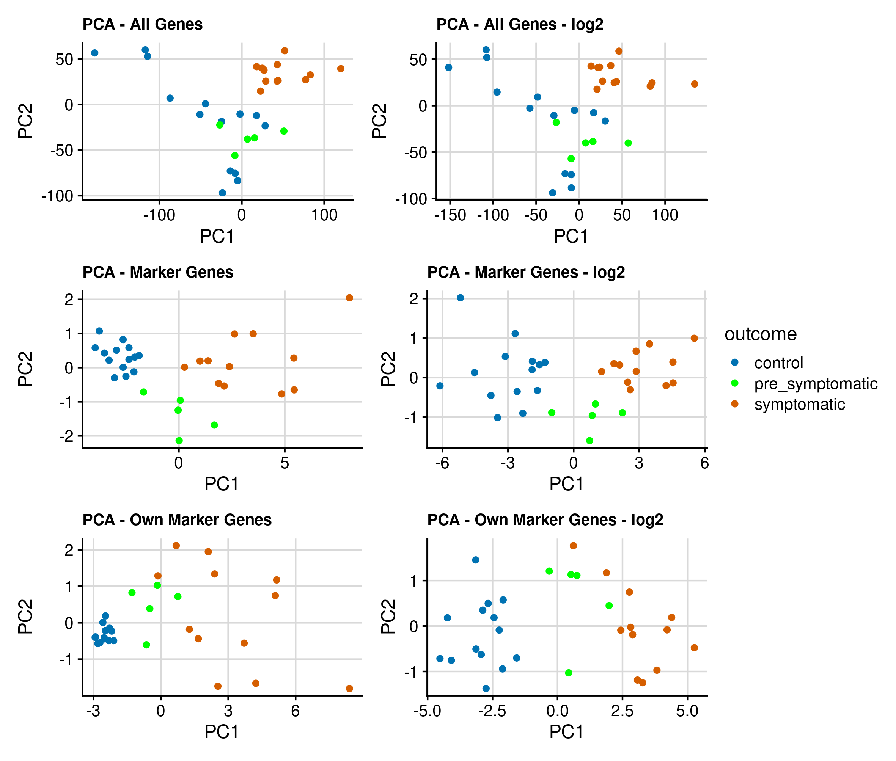
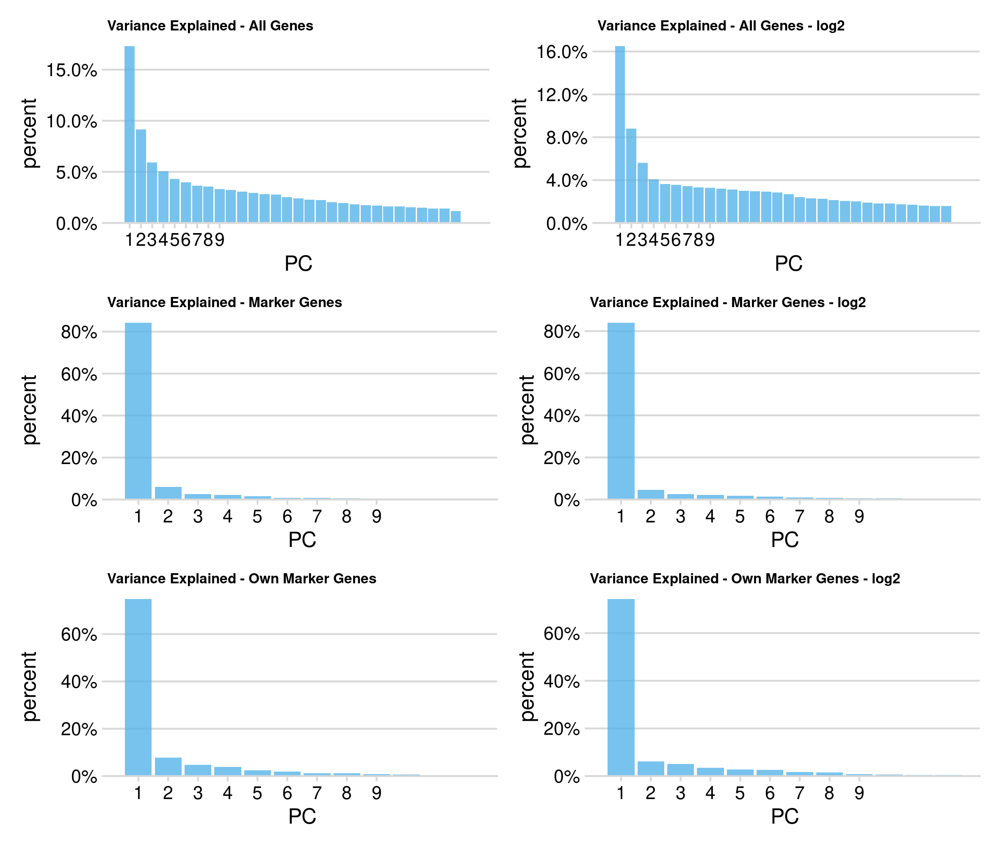
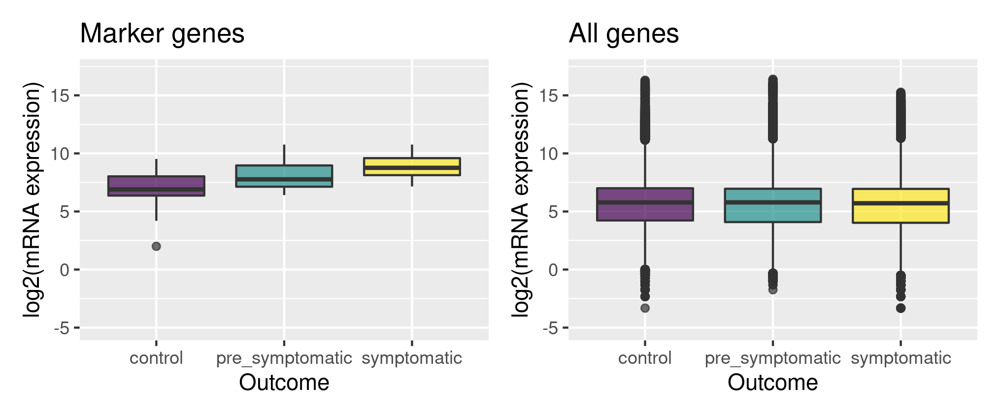
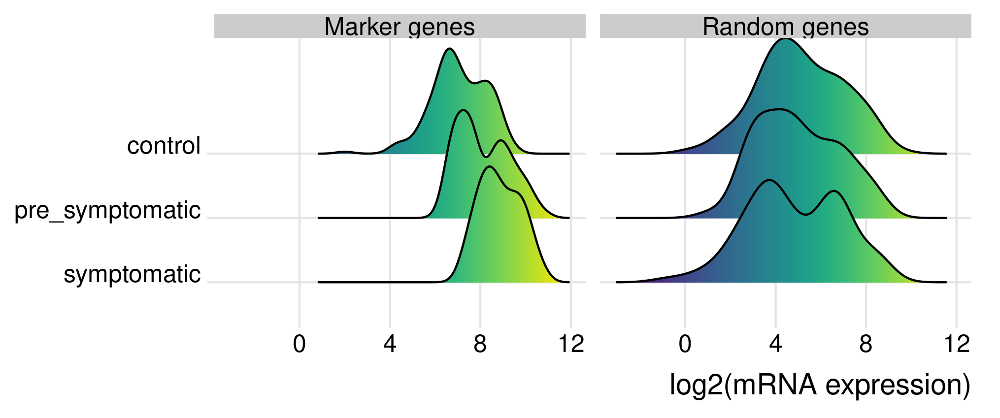
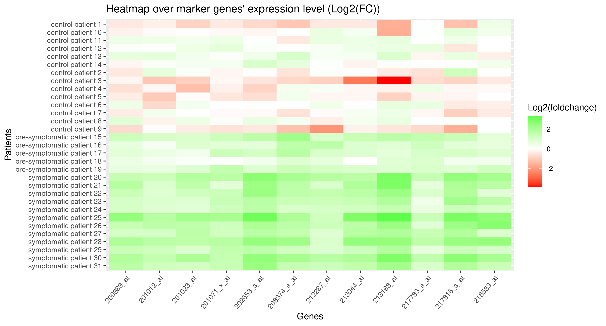
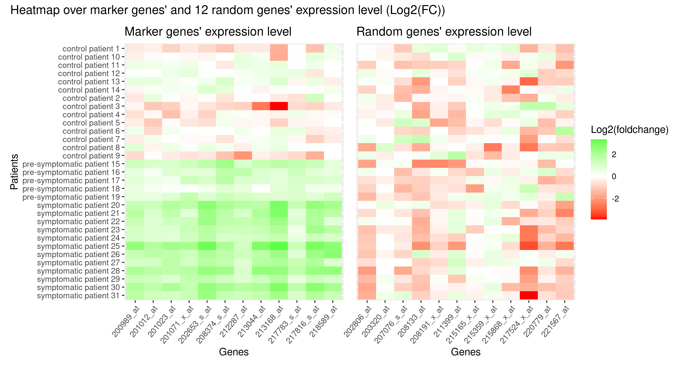

```{r setup, include=FALSE}
knitr::opts_chunk$set(echo = FALSE)
```


# Introduction

## Introduction

__Huntington's disease__:<br>
- Leads to deteriorating nerve cells in the brain (As well as motoric, cognitive and psychiatric impairments)<br>
- Inherited disease<br>
- Currently has no cure<br>
- Early diagnosis can help mitigate several problems (education of patient and family, some symptoms)

# Materials and method

## Materials and method
Borovecki F. _et al_, 2005 <br><br>

Expression data from:<br>
- 14 healthy controls<br>
- 5 pre-symptomatic patients<br>
- 12 symptomatic patients

# Results

## Log2 fold change of gene expression

```{r log2_fold_change own genes, echo=FALSE, fig.cap="Own marker genes", out.width = '100%'}

```

## Log2 fold change of gene expression 

```{r log2_fold_change paper genes, echo=FALSE, fig.cap="Marker genes from the paper", out.width = '100%'}

```


## PCA

```{r pca, echo=FALSE, fig.cap="PCA analysis of gene expression data", out.width = '55%'}

```
## PCA

```{r variance, echo=FALSE, fig.cap="Variance Explained by components", out.width = '55%'}

```

## Distribution of gene expression

```{r boxplot, echo=FALSE, fig.cap="", out.width = '100%'}

```


## Distribution of gene expression

```{r ridgeline, echo=FALSE, fig.cap="", out.width = '100%'}

```

## Heatmap marker genes

```{r heatmap_marker_genes, echo=FALSE, fig.cap="", out.width = '100%'}

```


## Heatmap marker and random genes

```{r heatmap_marker_genes_and_random, echo=FALSE, fig.cap="", out.width = '100%'}

```


## k-means

```{r k-means, echo=FALSE, fig.cap="", out.width = '100%'}
knitr::include_graphics("../Results/kmeans_plots.png")
```


# Discussion

## Discussion
- 12 genes show upregulated expression
- Pre-sympotimatic patients
- Early diagnosis; Preparing patients and their families
- Further research leading to treatment

## Questions?